## Behavioral Cloning

The project contains code for training neural network which can drive car in a simulator ([Windows](https://d17h27t6h515a5.cloudfront.net/topher/2017/February/58ae4419_windows-sim/windows-sim.zip), [macOS](https://d17h27t6h515a5.cloudfront.net/topher/2017/February/58ae4594_mac-sim.app/mac-sim.app.zip), [Linux](https://d17h27t6h515a5.cloudfront.net/topher/2017/February/58ae46bb_linux-sim/linux-sim.zip)).
Training data is not included. Project uses [**Keras**](https://keras.io/) library.

In order to collect images for training:
* run simulator in training mode
* press `RECORD` button and select output location
* press `RECORD` button again to start recording
* drive. Better to use wheel controller or gamepad with analog stick. It will produce better quality training data.
* press `RECORD` button to stop recording
* put recorded images and CSV file into `.\captured_data\` folder

The goals / steps of this project are the following:
* Use the simulator to collect data of good driving behavior
* Build, a convolution neural network in Keras that predicts steering angles from images
* Train and validate the model with a training and validation set
* Test that the model successfully drives around track one without leaving the road
* Summarize the results with a written report


[//]: # (Image References)

[image0]: ./data/_t_steering_angles.png "Steering angles of training data set"
[image1]: ./data/_v_steering_angles.png "Steering angles of validation data set"
[image2]: ./data/graph.png "Model graph"
[image3]: ./data/loss.png "Training loss"
[image4]: ./data/v_loss.png "Training loss"

**Project structure and usage examples**
* `code` folder, contains all rquired code to train the network. `.\code\main.py` is the entry point. Here is an example of usage:

    ```
    python model.py --batch=25 --epochs=5 --dropout=0.5 --description=""
    ```

    All parameters are optional:
    * `batch` is a batch size (defauld value is 20)
    * `epochs` number of epochs (defaul value is 1)
    * `dropout` is a dropout rate for model's dropout layer (default value is 0.5)
    * `description` is run description (defaul value is empty text)

    Each `model.py` run will produce separate folder with `model.h5` file and detailed run information under `.\output\` location. The information in JSON format also will be added into `.\output\history.log` file. So it's easy to collect and compare different run results.
* `model.h5` is already trained Keras model that can drive car on the first track both forward and backward
* `forward.mp4` and `backward.mp4` files are video recordings of supplied `model.h5` neural network behavior
* `drive.py` file contains script that drives car in simulator in autonomous mode using pre-trained neural network. Here is an example of usage:
   * run simulator
   * select *AUTONOMOUS MODE*
   * execute `python drive.py model.h5` (`model.h5` is a path to pre-trained neural network)
   * enjoy :)

**Model Architecture and Training Strategy**

<h6>Model architecture</h6>

My final solution uses [**LeNet**](http://yann.lecun.com/exdb/lenet/) model with extended dense layers. The model was initially designed to recognize character recognition. But it occures that it able to recognize patterns of road turns. Here is it's configuration:

|Layer name              |  Layer type                 |Output Shape       |Param #    |
| ---                    | ---                         | ---               | :---:     |
|normalization           |Lambda                       |(None, 160, 320, 3)|0          |
|cropping                |Cropping2D                   |(None, 65, 320, 3) |0          |
|conv1_5x5_relu          |Conv2D 5x5 + RELU activation |(None, 61, 316, 6) |456        |
|max_pooling1_2x2        |MaxPooling 2x2               |(None, 30, 158, 6) |0          |
|conv2_5x5_relu          |Conv2D 5x5 + RELU activation |(None, 26, 154, 16)|2416       |
|max_pooling2_2x2        |MaxPooling 2x2               |(None, 13, 77, 16) |0          |
|conv3_5x5_relu          |Conv2D 5x5 + RELU activation |(None, 9, 73, 28)  |11228      |
|max_pooling3_2x2        |MaxPooling 2x2               |(None, 4, 36, 28)  |0          |
|flatten                 |Flatten                      |(None, 4032)       |0          |
|fully_connected_1       |Dense                        |(None, 180)        |725940     |
|fully_connected_2       |Dense                        |(None, 95)         |17195      |
|dropout                 |Dropout                      |(None, 95)         |0          |
|readout                 |Dense                        |(None, 1)          |96         |
|**Total params**        |                             |                   |**757,331**|
|**Trainable params**    |                             |                   |**757,331**|
|**Non-trainable params**|                             |                   |**0**      |


The model is constructed by factory located in `.\code\nn_model_factory.py` file.
Model learnin process uses Adam optimized and mean squared error function for loss measurement.

<h6>Training and validation data</h6>

Input data consisted from images captured during 3 laps of manual driving in each direction. As the result my `driving_log.csv` file had 9348 rows. I also used flip horizontal image data augmentation with steering angle sign inversion on entire data set. Just right after driving log loaded and parsed I shuffle it and split on training and validation data.

Here is some statistics from provided model training run.

Training data had 16825 examples of 91 unique steering angles. Here is angle/images amount dependency:

![alt text][image0]

And some random images:

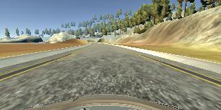 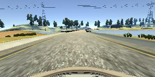 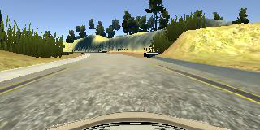 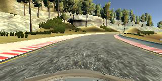

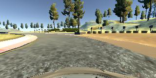 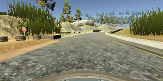 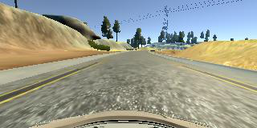 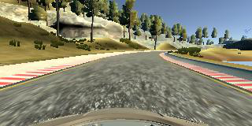
<br/>
<br/>
Validation data had 1850 examples of 71 unique steering angles. And it's angle/images amount dependency:

![alt text][image1]

Some validation image examples:

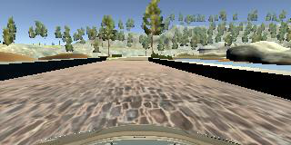 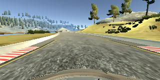 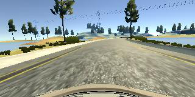 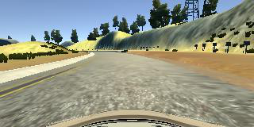

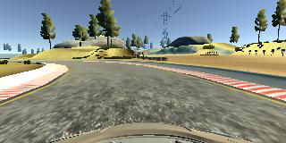 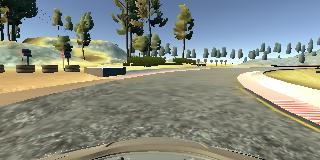 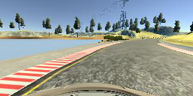 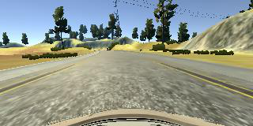
<br/>
<br/>
<h6>Solution design approach</h6>

I started with suggested technique - create something extremely simple that somehow works and improve it. So I used one flatten layer and output layer with one element for network model. And I collected almost 2 laps of data to check how everything works.

The first thing I did was the data wrapper. It allows images data loading at the moment it needed, data set extension with help of augmentation functions, data summary information and data shuffling.
Then I created logger to be able to collect, compare and analize different models and different conditions. And I updated model to LeNet-5, it has about 500k parameters. The model also has dropout layer to control overfitting. The model was good enough to get me over the bridge, so I decided to stick to it and extend it abit or improve quality of input data. I started from input data.

Data statistics said that the major part of images contained 0 steering angle. So I decided that model will drive better if I provide more images with non zero angle for learning. It was wrong decision. I also tried to extend my initial data with augmentation functions and left+right camera images. Most of my augmentation functions had low performance. It was hard to experiment with model that learns longer then 10 min. At the end I decided to collect training data again, using lowest resolution and steering more carefully. So I collected 3 laps of data for each direction. And then I found some bugs in my data wrapper. When I fixed everything I managed to traing original LeNet model, so it could drive in acceptable way. But next training cycle gave me non properly driving model. And I decided to find out how to build model which does not have training randomness. And each training result drives good.

During development I faced other difficulties. I discovered that batch size influence on model accuracy, not only trining time like I thought. Another surprising for me thing was relation of loss value statistics Keras outputs in consone and how actually model drives. I trained model for many epochs and reached quite low loss, but resulting model was driving terribly.

After some experiments I decided to extend model capacity, so I added more elements into dense layers. And now model has about 750k parameters. I have an impression that model started driving more smoothly.

I haven't managed to overcome training result randomness. I tried dedicated set for validation data, to have constat values in training set. Also I found out my data set is good enough to give well driving model with no augmentation. Final training process uses only flip horizontal augmentation, It's fast and it pushes car more to the center of road. With my set of data about each 10th training result is able to drive car properly. I have some more ideas to reduce this randomness, and maybe I'll come back to it later on.

<h6>Some more information about provided model</h6>

Model training have taken 3.7 minutes. Model training hyper parameters:

|parameter     | value|
| ---          |:---: |
| epochs       | 5    |
| batch size   | 25   |
| dropout      | 0.5  |
| optimizer    | adam |
| loss function| mse  |

Data information:

 **9348** images were generated by flip horizontally augmentation

Training set

|                           | value  |
| ---                       | :---:  |
| training items            | 16825  |
| unique steering angles (t)| 91     |
| zero angle images (t)     | 53.25% |

Validation set

|                           | value  |
| ---                       | :---:  |
| validation items          | 1850   |
| unique steering angles (v)| 71     |
| zero angle images (V)     | 53.73% |

The model grapgh:

![alt text][image2]

Training loss (final loss value is 0.0047058):

![alt text][image3]

Validation loss (final loss value is 0.0046137):

![alt text][image4]

`.\data\log_entry.json` file contains more detailed information about model and training conditions